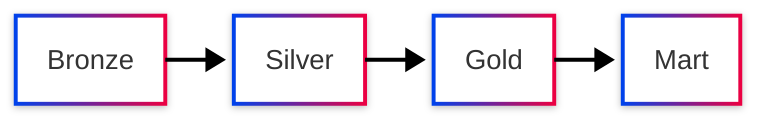

import Chart from '../../components/interactive/Chart.tsx';
import Stepper from '../../components/interactive/Stepper.tsx';
import PyodideCell from '../../components/interactive/PyodideCell.tsx';
import Insight from '../../components/Insight.astro';

Each block below is a different *tier* of interactivity, and each ships only the JS it needs.

<Insight>
The interactive tiers are also teaching tools: a diagram shows the model, a chart makes data
tangible, a stepper walks through a process, and a runnable cell lets you try it. Reach for the
lightest one that makes the idea click.
</Insight>

## 1. Diagram (build time, zero JS)

## 2. Chart (hydrates when scrolled into view)

<Chart client:visible />

## 3. Reactive walkthrough

<Stepper client:visible />

## 4. Runnable Python (loads Pyodide on demand)

<PyodideCell client:idle initialCode="print(sum(range(10)))" />
